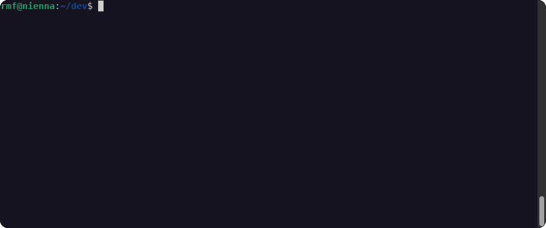

# what

This is a tool that generates static sites visualizing the unit stats for Rome: Total War mods (for both the remastered and the original game).

[](https://faust.rmf.io)

# how



Start by creating a subfolder called `faust` inside your mod's folder (alongside the `data`, not inside). In there you should create a couple of files before generating anything.

- Create an image file named `banner.png`. The dimensions should be 512x256 pixels. This file will be used as the banner for the mod on the generated site.
- Create a text file named `faust.yml` and enter the following as the contents:

  ```yaml
  id: mod_id
  name: The Name of the Mod
  campaign: campaign_folder
  ```

  You can replace `mod_id` with whatever you want to be used in the site URLs to identify the mod, `The Name of the Mod` with whatever text you want
  to be used to identify the mod in the site's pages, and `campaign_folder` with the name of your mod's campaign folder. (At present, only one campaign
  is supported; support for mods with multiple campaigns will come later.)

Grab a release build from the [releases](https://github.com/rmartinho/faust/releases) page. Then you can either:

- on Windows you can just double-click the `faust.exe` file and it will ask you to find the `faust.yml` file with a file open dialog; or
- run `faust path/to/faust.yml` in a terminal (obviously replace that with the correct path to the `faust.yml` file).

This will parse the mod folder and output all of the site files into a folder named `site` next to the `faust.yml` file. It will also start a
small web server that lets you browse the site locally right away.

You can then upload the contents of that folder to your favourite static site hoster (e.g. GitHub Pages) if you want to publish it for others.

# when

This project is currently under development, and made available only for testing purposes. It will be ready when it is ready.
